# PlatformMania

## Фичи

### 1) Двойной прыжок
- Что делает: позволяет выполнить второй прыжок в воздухе.
- Как работает: после отрыва от земли игрок получает второй прыжок.
- Как проверить: нажать кнопку прыжка повторно в воздухе.
- Видео: https://youtu.be/sVtDciuECmc
- Скриншоты:
  - 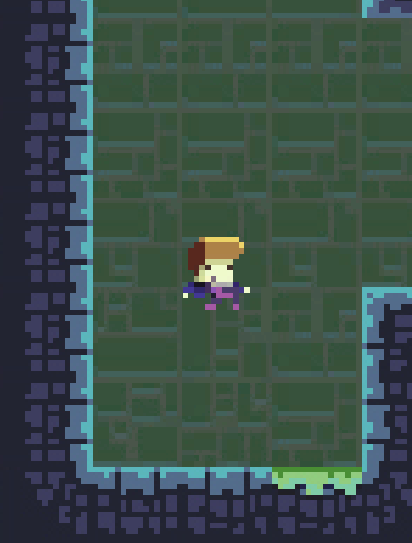
  - 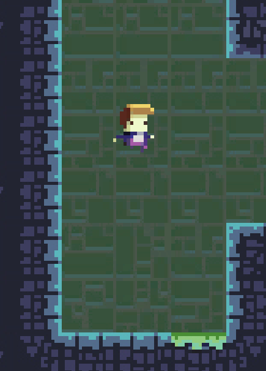

### 2) Прыжок от стен
- Что делает: позволяет отталкиваться от стены для достижения высоты или направления. Ограниченное количество прыжков от стен - 4.
- Как работает: зажимается кнопка прыжка вблизи стены; направление учитывается по коллизиям.
- Как проверить: подбежать к стене и нажать прыжок.
- Видео: https://youtu.be/kUB1b3Ukuh0
- Скриншоты:
  - 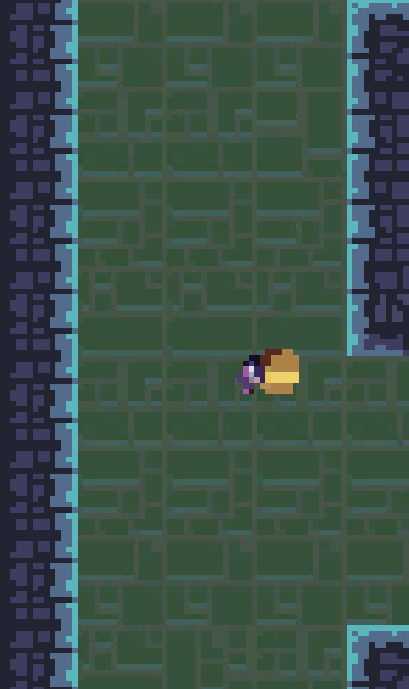

### 3) Скольжение по стенам
- Что делает: ускоренное спускание вдоль стены; может давать шанс использовать для перемещения.
- Как работает: активация на стене.
- Как проверить: прикоснуться к стене, находясь в воздухе.
- Видео: https://youtu.be/PmOa1h6mKo4
- Скриншоты:
  - 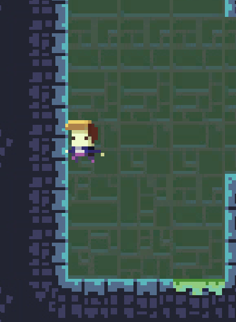

### 4) Система чекпойнтов
- Что делает: сохраняет прогресс на уровне; при смерти возвращает игрока к ближайшему чекпойнту.
- Как работает: создание чекпойнтов по мере продвижения; загрузка состояния.
- Как проверить: пройти до чекпойнта, умереть и увидеть возврат к чекпойнту.
- Видео:
-   https://youtu.be/3B-HF8Cq18c - Установка чекпоинта
-   https://youtu.be/cus4hRG28n0 - Перезагрузка после смерти от противника (soft death)
- Скриншоты:
  - 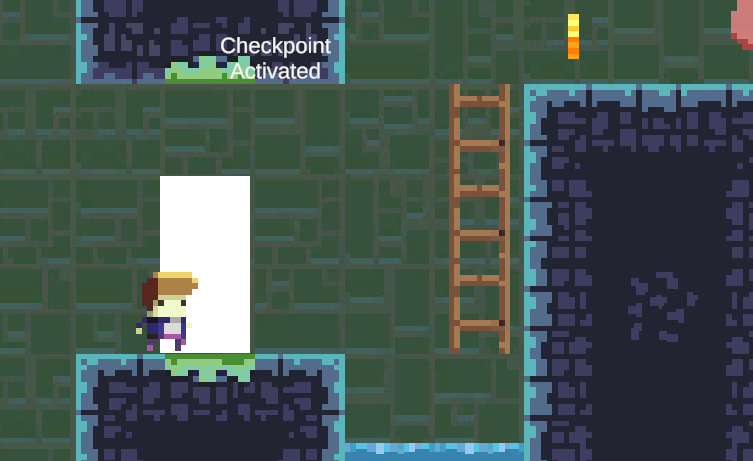

### 5) Стрельба
- Что делает: бой с врагами на расстоянии.
- Как работает: обработка патронов, попадания по целям.
- Как проверить: стрельба по врагам и проверка урона/попаданий.
- Видео: https://youtu.be/pTZvUqPOZ74
- Скриншоты:
  - 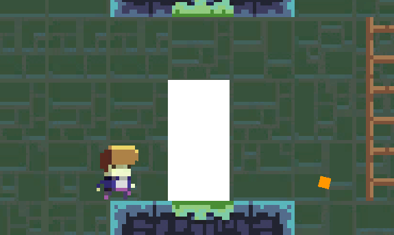

### 6) Здоровье
- Что делает: отображение и падение здоровья персонажа.
- Как работает: урон от врагов и окружения.
- Как проверить: получить фатальный урон и проверить смерть/перезагрузку.
- Видео:
-   https://youtu.be/3B-HF8Cq18c - Смерть игрока от окружения
-   https://youtu.be/cus4hRG28n0 - Смерть игрока от противника
- Скриншоты:
  - 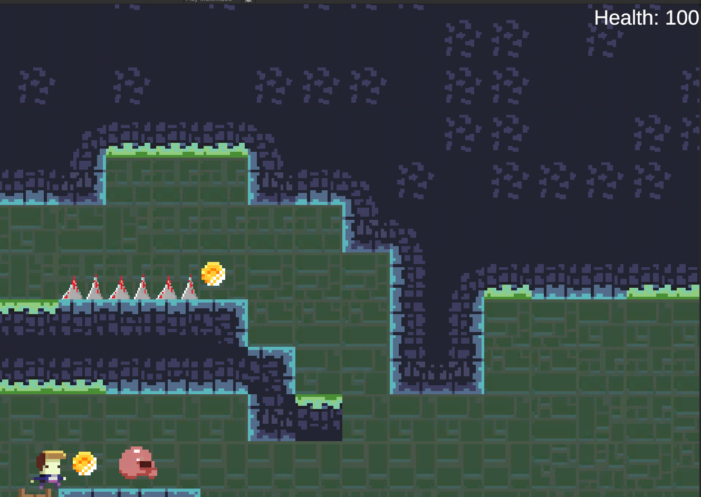
  - 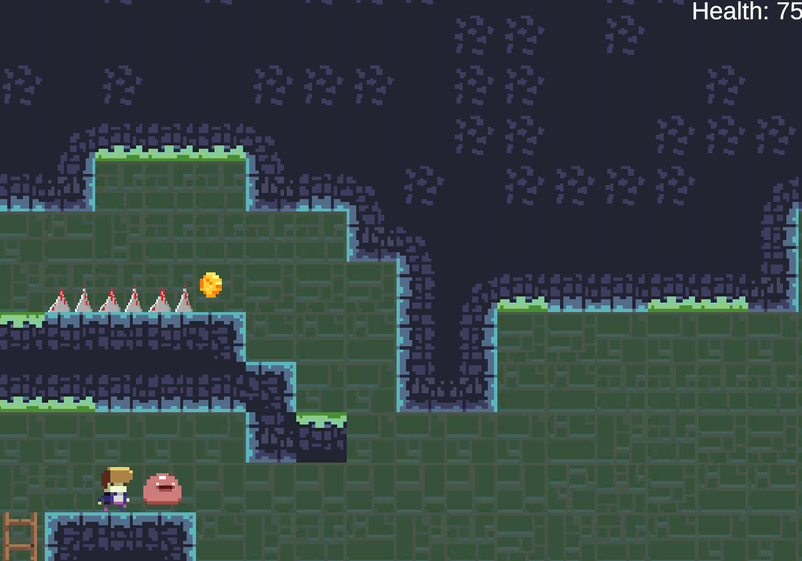

### 7) Подбор монет
- Что делает: сбор монет для очков/прогресса.
- Как работает: детектор коллизий, счёт монет, UI.
- Как проверить: подобрать монету и проверить увеличение счёта.
- Видео: https://youtu.be/qwahPOfQOn8
- Скриншоты:
  - 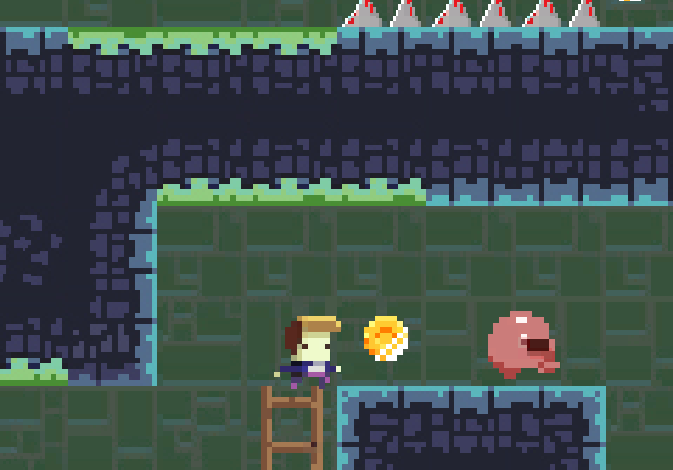
  - 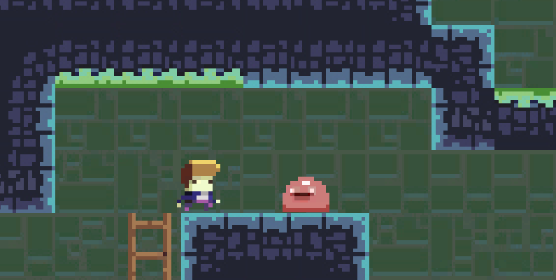

### 8) Использование лестниц
- Что делает: перемещение по лестницам в верхнем или нижнем направлении, можно стоять на ступени лестницы.
- Как работает: триггеры лестниц, управление скоростью/перемещением.
- Как проверить: войти на лестницу и подняться/спуститься.
- Видео: https://youtu.be/GYefV0BCQ4Y
- Скриншоты:
  - 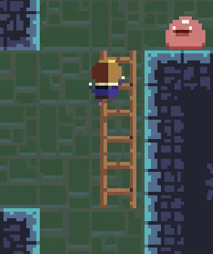
  - 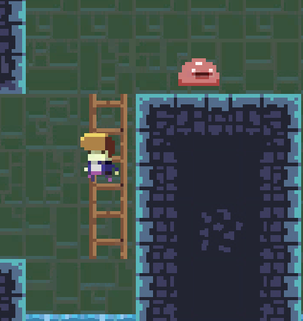

### 9) Противники
- Что делает: враги с патрульной логикой поведения.
- Как работает: патруль по платформе.
- Как проверить: столкновение с врагами и реакция на урон.
- Видео:
-   https://youtu.be/JuKkLQJQ2AI - Патрулирование
-   https://youtu.be/pTZvUqPOZ74 - Смерть противника
-   https://youtu.be/cus4hRG28n0 - Смерть игрока от противника
- Скриншоты:
  - 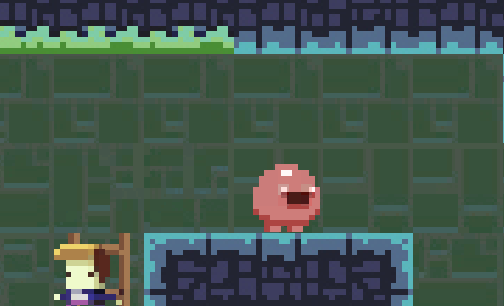

### 10) Смерть
- Что делает: обработка смерти персонажа и переход к смерти/рестарту.
- Как работает: повторная загрузка чекпойнта, повторный спаун противников и монет.
- Как проверить: смерть персонажа и повторный старт.
- Видео: https://youtu.be/3B-HF8Cq18c
- Скриншоты:
  - 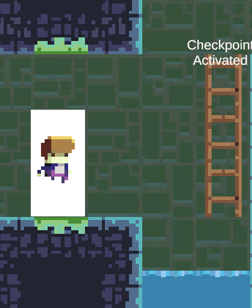

### 11) Окружение (урон окружения)
- Что делает: окружение может наносить фатальный урон игроку. 
- Как работает: триггеры урона.
- Как проверить: попасть в опасную зону и смерть (soft death).
- Видео: https://youtu.be/3B-HF8Cq18c
- Скриншоты:
  - 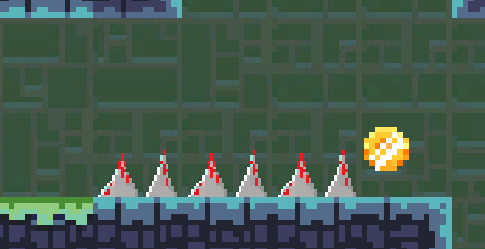
